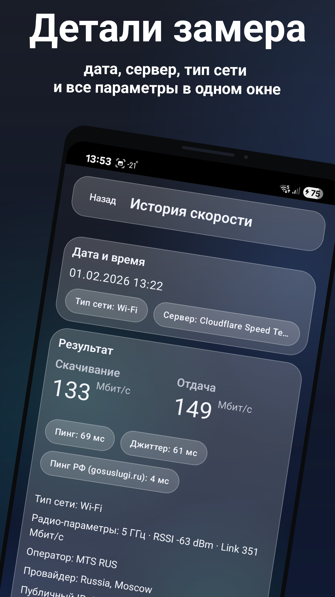
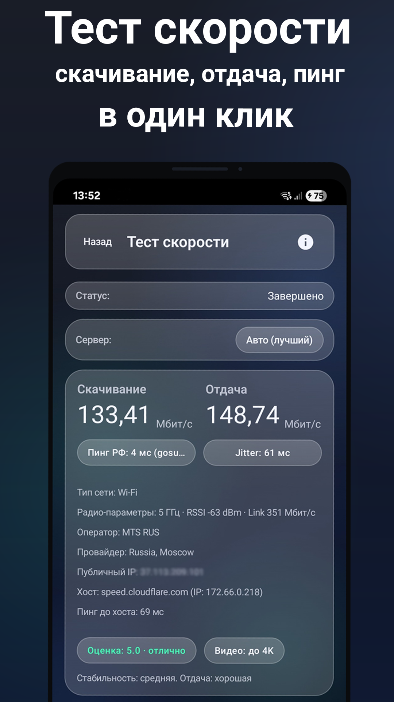
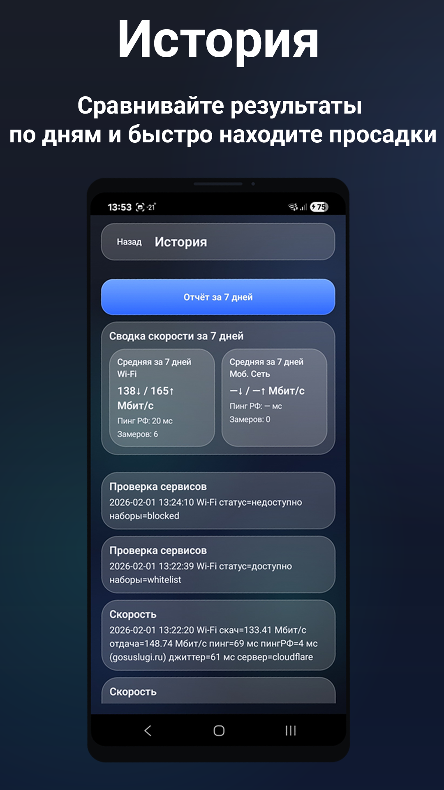

# StateOfNetwork


RU. StateOfNetwork — Android-приложение для наблюдения за состоянием сетевого подключения устройства. Проект ориентирован на практическую задачу: быстро понять, есть ли соединение, какой тип сети активен, и как меняется состояние при переключении между Wi-Fi и мобильной сетью. Акцент сделан на корректной обработке системных событий и на предсказуемом поведении без “обновилось только после перезапуска”.

EN. StateOfNetwork is an Android app for observing the device network connectivity state. The goal is pragmatic: quickly understand whether connectivity is available, which transport is active, and how the state changes when switching between Wi-Fi and cellular networks. The focus is on reliable system callbacks and predictable behaviour without “it only updates after restart”.

## Run

Android Studio: open the project, wait for Gradle Sync, then run the `app` configuration.

Terminal build:
```bash
./gradlew assembleDebug

```

## Screenshots

<p align="center">
  
  
  
  
</p>